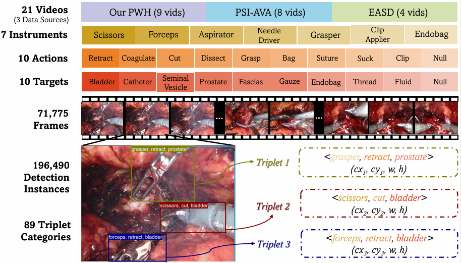
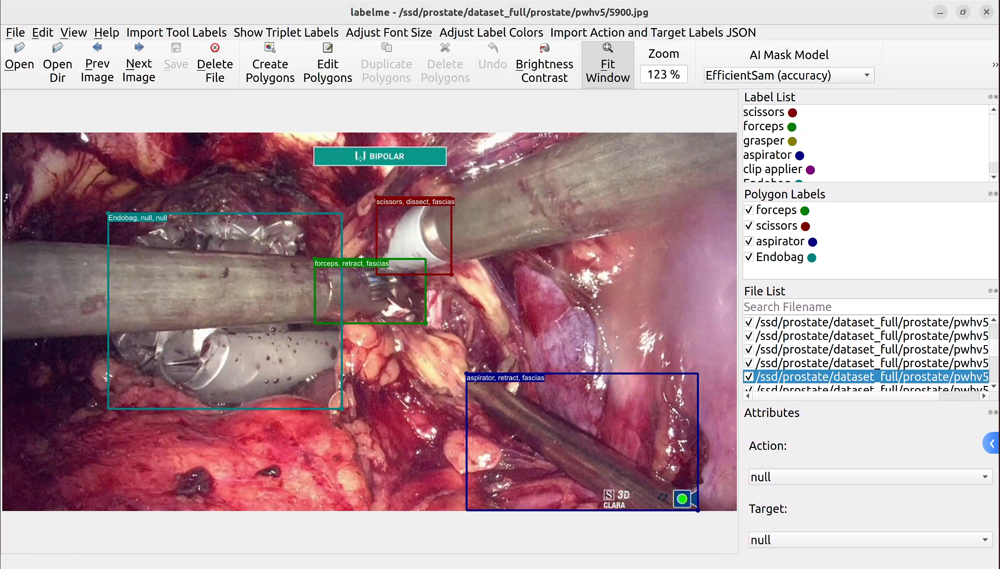
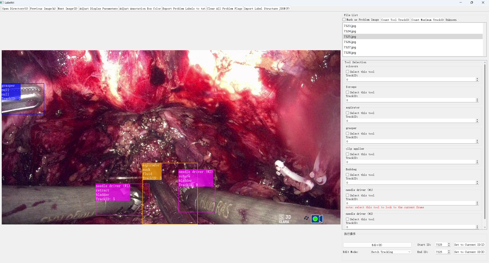

# ProstaTD

### **ProstaTD: A Large-scale Multi-source Dataset for Structured Surgical Triplet Detection**
*Yiliang Chen, Zhixi Li, Cheng Xu, Alex Qinyang Liu, Xuemiao Xu, Jeremy Yuen-Chun Teoh, Shengfeng He, Jing Qin*

[](https://arxiv.org/pdf/2506.01130)


## Abstract
<div align="center">
  
</div><br/>

ProstaTD is a large-scale surgical triplet detection dataset curated from 21 robot-assisted prostatectomy videos, collectively spanning full surgical procedures across multiple institutions, featuring 60,529 annotated frames with 165,567 structured surgical triplet instances (instrument-verb-target) that provide precise bounding box localization for all instruments alongside clinically validated temporal action boundaries. The dataset incorporates the [ESAD](https://saras-esad.grand-challenge.org/download/) and [PSI-AVA](https://github.com/BCV-Uniandes/TAPIR) datasets with our own added annotations (without using the original data annotations). We also include our own collected videos. It delivers instance-level annotations for 7 instrument types, 10 actions, 10 anatomical/non-anatomical targets, and 89 triplet combinations (excluding background). The dataset is partitioned into training (14 videos), validation (2 videos), and test sets (5 videos), with annotations provided at 1 frame per second.

### Dataset Format
Each instance within every frame of the dataset video is represented as a 10-value tuple:   
**"frame_id": [triplet_id, instrument_id, verb_id, target_id, track_id, triplet_track_id, cx, cy, w, h]**

| Position | Field Name        | Description                                                                 | Current Status               |
|---------|-------------------|-----------------------------------------------------------------------------|-------------------------------|
| 0       | Triplet ID        | Unique identifier for the (instrument, verb, target) triplet                | **Available**                 |
| 1       | Instrument ID     | Identifier for the instrument (subject) in the triplet                     | **Available**                  |
| 2       | Verb ID           | Identifier for the action verb connecting instrument and target             | **Available**                 |
| 3       | Target ID         | Identifier for the target (object) in the triplet                           | **Available**                 |
| 4       | Track ID          | Unique identifier for instrument tracking in video                          | *Pending*                     |
| 5       | Triplet Track ID  | Unique identifier for full triplet instance tracking                        | *Pending*                     |
| 6       | cx                | Normalized bounding box center x-coordinate (0-1 range)                     | *Pending*                     |
| 7       | cy                | Normalized bounding box center y-coordinate (0-1 range)                     | *Pending*                     |
| 8       | w                 | Normalized bounding box width (0-1 range)                                  | *Pending*                      |
| 9       | h                 | Normalized bounding box height (0-1 range)                                 | *Pending*                      |

**Key Notes:**
1. Positions 0-3 contain currently available data
2. Positions 4-9 will be released soon
3. All pending fields currently use placeholder value `-1`
4. Bounding box coordinates (cx, cy, w, h) are normalized to [0,1] range relative to frame dimensions
5. Some frames were removed due to non-surgical scenes or adverse environmental factors (e.g., extreme reflection); overall, the frames are visually continuous​

### Usage
If you want to try using this dataset on your model, please refer to the [training example](https://github.com/SmartHealthX/ProstaTD/tree/main/framework) and [benchmarking package](https://github.com/SmartHealthX/ProstaTD/tree/main/ivtdmetrics)

### Contact: 
To report errors or suggest improvements, please open an issue on our GitHub repository or email dataset.smarthealth@gmail.com. All valid corrections will be incorporated in future releases. The ProstaTD dataset will be actively maintained and updated by the authors to ensure long-term accessibility and support ongoing research.

### Download Access:
To request access to the ProstaTD Dataset, please fill out our [request form](https://forms.gle/W8aGcb5c48YCXV1L9).

Early Access: The latest **ProstaTD v2.0** has expanded annotations to 70k+ frames with full annotations (the form is temporarily unavailable for v2.0 access; you need to submit an email with a detailed plan for manual review)

**Important Notes:**  
🔹 **Recommended Email**: Advice use **Gmail**​​ for submission (other emails may find the reply in spam folders).  
🔹 **Response Time**: If you haven't received access instructions within **one hour**, please send a follow-up email to us with subject "ProstaTD Access Request - [Your Name]". We'll manually process your request and send the download link within **2 business days**. 

## News
- [ **31/07/2025** ]: Release of the ProstaTDv2.0 dataset.
- [ **02/06/2025** ]: Release of the ProstaTDv1.1 dataset on GitHub, which includes minor annotation corrections.
- [ **16/05/2025** ]: Release of the ProstaTDv1.0 dataset on kaggle.

## To-Do List
- ✅ Release classification labels
- ✅ Release new [ivtdmetrics](https://github.com/SmartHealthX/ProstaTD/blob/main/ivtdmetrics) metric tool  
  *([ivtmetrics](https://github.com/CAMMA-public/ivtmetrics) not compatible with Triplet Detection)*
- ✅ Provide [training examples](https://github.com/SmartHealthX/ProstaTD/blob/main/framework) on ProstaTD 
- ⭕️ Release bounding box annotations and preprocessing scripts
- ⭕️ Release raw LabelMe JSON files and annotation tool for visualization
- ⭕️ Release raw 30fps frames and track ID annotations for tracking
- ⭕️ Release raw video

## Examples

<table>
  <tr>
    <td><center></center></td>
    <td><center></center></td>
  </tr>
  <tr>
    <td><center>Our custom labelme annotation example</center></td>
    <td><center>Our labeltri annotation example</center></td>
  </tr>
</table>

Some classification results of our ProstaTD (Prostate21) can be found at [SurgVISTA](https://arxiv.org/pdf/2506.02692)


## Usage Restrictions
The dataset and its annotations are intended for academic research purposes only and must not be used for commercial purposes. If the dataset is used to train models or LLMs, the output must include a warning prompt stating that the results are generated based on experimental data and should not be used for actual surgical environment without further validation. Additionally, these models must be used under human supervision to ensure safety and accuracy.

## License
This repository is available for non-commercial scientific research purposes as defined in the [CC BY-NC-SA 4.0](https://creativecommons.org/licenses/by-nc-sa/4.0/).

## Citation
```bibtex
@article{chen2025prostatd,
  title     = {ProstaTD: A Large-scale Multi-source Dataset for Structured Surgical Triplet Detection},
  author    = {Yiliang Chen and Zhixi Li and Cheng Xu and Alex Qinyang Liu and Xuemiao Xu and Jeremy Yuen-Chun Teoh and Shengfeng He and Jing Qin},
  journal   = {arXiv preprint arXiv:2506.01130},
  year      = {2025}
}
```


