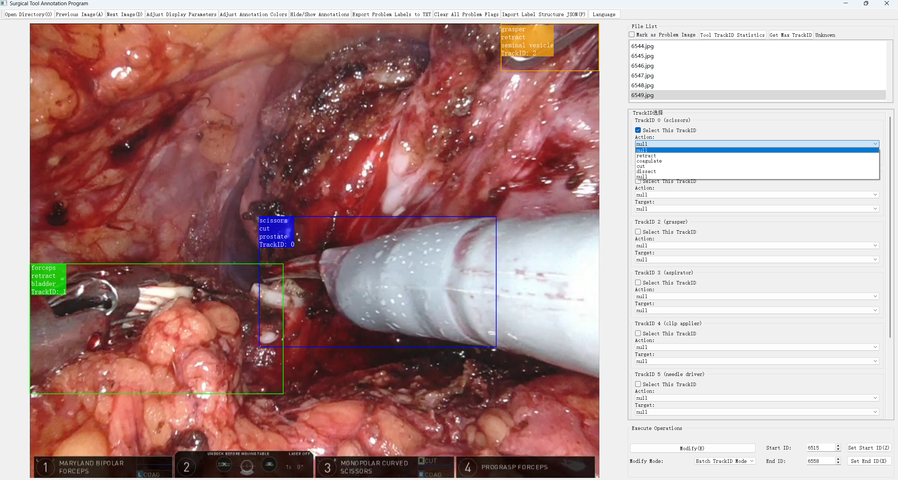

# ProstaTD

### **ProstaTD: A Large-scale Multi-source Dataset for Structured Surgical Triplet Detection**
*Yiliang Chen, Zhixi Li, Cheng Xu, Alex Qinyang Liu, Xuemiao Xu, Jeremy Yuen-Chun Teoh, Shengfeng He, Jing Qin*

## Abstract

  

 

ProstaTD is a large-scale surgical triplet detection dataset curated from 21 robot-assisted prostatectomy videos, collectively spanning full surgical procedures across multiple institutions, featuring 60,529 annotated frames with 165,567 structured surgical triplet instances (instrument-verb-target) that provide precise bounding box localization for all instruments alongside clinically validated temporal action boundaries. The dataset incorporates the [ESAD](https://saras-esad.grand-challenge.org/download/) and [PSI-AVA](https://github.com/BCV-Uniandes/TAPIR) datasets with our own added annotations (without using the original data annotations). We also include our own collected videos. It delivers instance-level annotations for 7 instrument types, 10 actions, 10 anatomical/non-anatomical targets, and 89 triplet combinations (excluding background). The dataset is partitioned into training (14 videos), validation (2 videos), and test sets (5 videos), with annotations provided at 1 frame per second.

### Dataset format:
Our dataset format is: [triplet id, instrument id, verb id, target id, track id, triplet track id, cx, cy, w, h]. In the current release, the track id, triplet track id, cx, cy, w, and h have not been officially released yet and are temporarily replaced with the value -1. They will be released soon.

### Contact: 
To report errors or suggest improvements, please open an issue on our GitHub repository or email dataset.smarthealth@gmail.com. All valid corrections will be incorporated in future releases. The ProstaTD dataset will be actively maintained and updated by the authors to ensure long-term accessibility and support ongoing research.

### Download Access:
To request access to the ProstaTD Dataset, please fill out our [request form](https://forms.gle/W8aGcb5c48YCXV1L).

## News
- [ **02/06/2025** ]: Release of the ProstaTDv1.1 dataset on GitHub, which includes minor annotation corrections.
- [ **16/05/2025** ]: Release of the ProstaTDv1.0 dataset on kaggle.

## To-Do List
- ✅ Release classification labels
- ⭕️ Adapt [ivtmetrics](https://github.com/CAMMA-public/ivtmetrics)  
  *(original version not compatible with ProstaTD; the paper uses [ultralytics](https://github.com/ultralytics/ultralytics) calculation method)*
- ⭕️ Provide RDV training examples on ProstaTD
- ⭕️ Release bounding box annotations
- ⭕️ Release track ID annotations
- ⭕️ Release raw LabelMe JSON files and annotation tool for visualization

## Examples

<table>
  <tr>
    <td>

</td>
    <td>

</td>
  </tr>
  <tr>
    <td>
Our custom labelme annotation example
</td>
    <td>
Our labeltri annotation example
</td>
  </tr>
</table>

## Usage Restrictions
The dataset and its annotations are intended for academic research purposes only and must not be used for commercial purposes. If the dataset is used to train models or LLMs, the output must include a warning prompt stating that the results are generated based on experimental data and should not be used for actual surgical environment without further validation. Additionally, these models must be used under human supervision to ensure safety and accuracy.

## License
This repository is available for non-commercial scientific research purposes as defined in the [CC BY-NC-SA 4.0](https://creativecommons.org/licenses/by-nc-sa/4.0/).

